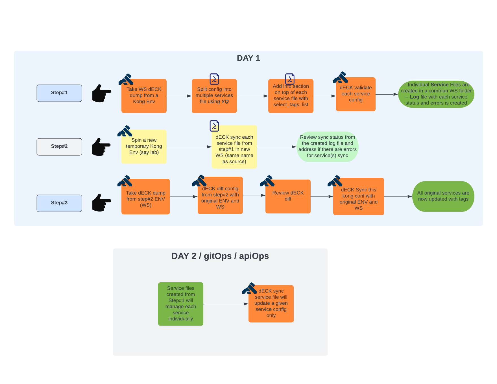
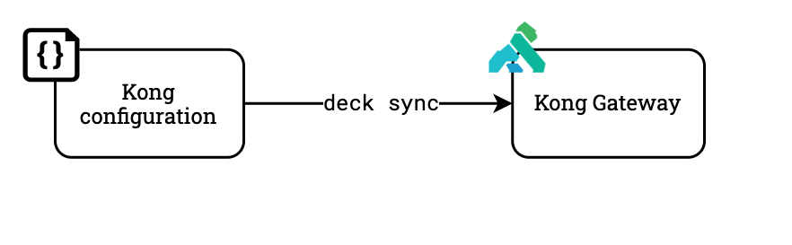

# Splitting Kong config from dumped from a WS into multiple service files.

> This project assumes you have a huge WS file. To manage Kong declaratively, there becomes a possibility of messing this file when certain sections are added or removed from this huge file.
What use case this exercise is going to solve? Below are some items of the use case:

- Customers who have built kong configs via admin apis or kong manager.
- Customers who did not tag all the components of the service with a common standard tag.
- Now customer environment has become huge and each WS has 100s of services.
- Now customer also want to manage their Kong configs declaratively.
- Customer doesn't want to make the change to the huge single Kong config file but still want to make service specific changes.
- Each service owner was not individually able to manage their service.

This repository provides a guideline to split already existing kong configs into separate individual service files. Shell scripts are output of this exercise. Below are the pre-reqs:

- `YQ` install where the script is executed [YQ](https://mikefarah.gitbook.io/yq/v/v3.x/).
- Apply the configuration to the Gateway using Kong's declarative configuration
    tool [`decK Overview`](https://docs.konghq.com/deck/overview/), [`deck install`](https://docs.konghq.com/deck/latest/installation/).

Here is a diagram containing the full workflow:



This repository also includes sample Github Action runner scripts (under
`~/.github`) that can be used to initiate the full APIOps/GitOps workflow
out-of-the-box when running in Github.

## Workflow

Below are some steps involved to get through the desired state of managing a Kong config declaratively per service.

### 1. Getting the kong `yaml` config file from a given workspace 

The first step is to get a `deck dump` from a given environment from a given WS.


To generate a deck dump, run:

```sh
deck dump -w <your-workspace> --kong-addr <admin-api-url> --headers kong-admin-token:<your-token> -o <workspace_kong.yaml>
```

Feel free to inspect the `kong.yaml` file.

### 2. Splitting the kong.yaml Configuration

The second step is to split the kong configuration into indiviual service files.


To validate our generated configuration file, run:

```sh
deck validate
```

### 3. Applying the Configuration

With our configuration generated with `kong.yaml`, we can now apply it to our
Kong instance using `deck`.



To apply the configuration with `deck`, run the commands below:

```sh
# BONUS: backup your current configuration - just to be safe
deck dump -o deck-backup.$(date +%s).yaml

# BONUS: review any changes prior to applying them
deck diff

# make it happen!
deck sync
```

> If you have RBAC enabled, then you'll want to add a `--headers
> "Kong-Admin-Token:yourtoken"` flag to the commands above in order to
> authenticate.

> If needed, you can scope your updates to a particular Kong workspace using the
> `--workspace` flag.

With the configuration successfully applied, you should see the changes take
place immediately. Try sending a request to any available routes for
verification.

### 4. Updating the documentation

With the runtime configuration in place, now it's time to update the API
documentation. This ensures that any consumer of our API has readily available,
up-to-date documentation.

To update the developer portal documentation for our service, run the following
command:

```sh
curl -XPUT localhost:8001/default/files/specs/httpbin.yaml --data contents=@openapi/orders.yaml
```

> The command above assumes you are updating the "default" workspace (noted by
> the `/default` URL prefix) with Kong running locally (noted by
> `localhost:8001`). You may need to update the command above to match your
> environment if you are running in a different environment.

In this example, we updated a single API in the Kong Developer Portal. While
this works for this use case, we could also have used the [`portal`
CLI](https://docs.konghq.com/enterprise/latest/developer-portal/helpers/cli/) to
update the entire developer documentation at once. If you or your team prefer
following a "GitOps" or "DocOps"-based workflow, the [`portal`
CLI](https://docs.konghq.com/enterprise/latest/developer-portal/helpers/cli/)
may provide a better alternative for updating your API documentation.

> [Insomnia](https://insomnia.rest/) also has built-in functionality for
> publishing APIs to your Kong developer portal using a graphical interface.

## Extras

### Enabling More Plugins

If you would like to include other plugins for your service, you can do so by
adding an `x-` extension to the API specification matching the plugin name and
configuration. 

For example, to configure the [rate limiting
plugin](https://docs.konghq.com/hub/kong-inc/rate-limiting/):

```yaml
x-kong-plugin-rate-limiting:
  enabled: true
  config:
    minute: 6
    limit_by: ip
    policy: local
```

The extension must start with `x-kong-plugin-` and then include the plugin name
in kebab-case format.

You can find a list of all available plugins in the Kong documentation
[here](https://docs.konghq.com/hub/).

## Questions?

Issues? Questions? Problems? Concerns? Don't hesitate to [reach
out](https://konghq.com/contact/).
