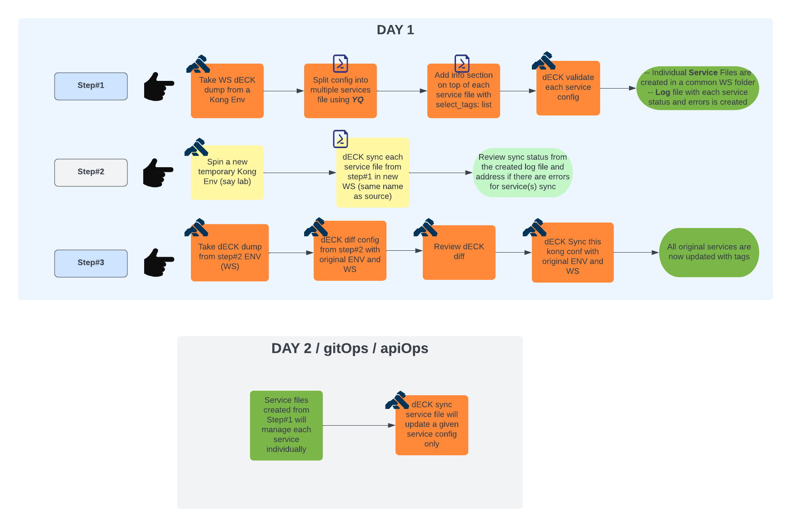
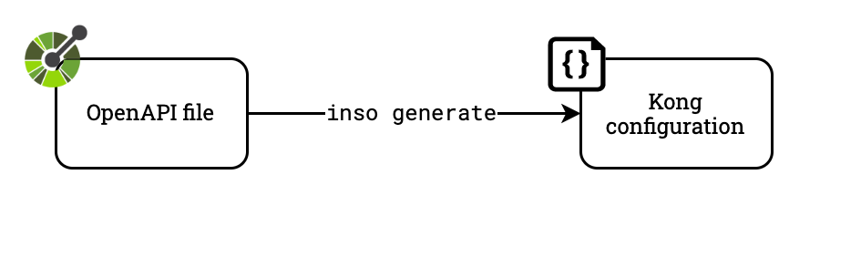

# Splitting Kong config from dumped from a WS into multiple service files.

> This project assumes you have a huge WS file. To manage Kong declaratively, there becomes a possibility of messing this file when certain sections are added or removed from this huge file.
What use case this exercise is going to solve? Below are some items of the use case:

- Customers who have built kong configs via admin apis or kong manager.
- Customers who did not tag all the components of the service with a common standard tag.
- Now customer environment has become huge and each WS has 100s of services.
- Now customer also want to manage their Kong configs declaratively.
- Customer doesn't want to make the change to the huge single Kong config file but still want to make service specific changes.
- Each service owner was not individually able to manage their service.

This repository provides a guideline to split already existing kong configs into separate individual service files. Shell scripts are output of this exercise. Below are the pre-reqs:

- `YQ` install where the script is executed [YQ](https://mikefarah.gitbook.io/yq/v/v3.x/).
- Apply the configuration to the Gateway using Kong's declarative configuration
    tool [`decK Overview`](https://docs.konghq.com/deck/overview/), [`deck install`](https://docs.konghq.com/deck/latest/installation/).

Here is a diagram containing the full workflow:



This repository also includes sample Github Action runner scripts (under
`~/.github`) that can be used to initiate the full APIOps/GitOps workflow
out-of-the-box when running in Github.

## Workflow

Below are some steps involved to get through the desired state of managing a Kong config declaratively per service.

### 1. Getting the kong `yaml` config file from a given workspace 

The first step is to get a `deck dump` from a given environment from a given WS.



```sh
deck dump -w <your-workspace> --kong-addr <admin-api-url> --headers kong-admin-token:<your-token> -o <workspace_kong.yaml>
```
If a user wants one shot then shell script has an option to generate the kong.yaml using `deck dump`. Or the deck dump kong.yaml can also be used as direct input to the script if user already have one:

Script syntax:

```sh
OPTION 1 :
==========
##Get deck dump config for a given workspace and then split##
syntax: ./kongSplitServices.sh -u <admin-api-url> -w <my-workspace> -t <my-token> -e <environment>

system requirements: "yq" and "deck" utilities need to installed!

OPTION 2 :
==========
##Input deck dump config for a given workspace and then split##
syntax: ./kongSplitServices.sh -f <Kong Config File> -w <my-workspace> -e <environment>

system requirements: "yq" utility need to installed!

"kongSplitServices.sh" input parameters:

  ::Required
  -u|--url <admin api host name>
  -t|--token <admin api token>
  -e|--env <Kong Deployment environment (like Dev, QA, Prod etc)>
  -f|--file <Input Kong Config File>

  ::Optional
  -w|--workspace <workspace from where config is targeted to be exported (default all-workspaces)>
  -p|--port <admin api port> (default 8001)
  -h|--protocol <http or https (default http)>
     --help (Script help)
     --debug (run script in debug mode)
```
Feel free to inspect the `kong.yaml` file.

### 2. Splitting the kong.yaml Configuration

The second step is to split the kong configuration into indiviual service files. All service objects need to be part of this service file. Since `upstreams` in `kong.yaml` are independent objects, service related upstreams can be found in 3 ways with this script.

- upstream name can be found as `host` value of `services` object for a given service
- `route by header` plugin can have upstream names
- `canary` plugin can have upstream names

After, all upstreams are found for a service, below info section is added to the service file on top. So the final service file contains root level arrays `_format_version`, `_info`, `_workspace`, `services` and `upstreams`.

```yaml
_info:
 defaults: {}
 select_tags:
 - "<your-service-tag(s)>"
```

To validate final service configuration file, script uses run:

```sh
deck validate
```
Final service config will look like below:

```yaml
_format_version: "1.1"
_info:
 defaults: {}
 select_tags:
 - "http-orders"
_workspace: "test"
services:
  - connect_timeout: 60000
    enabled: true
    host: http.kong.lan
    name: http-orders
    path: /anything
    plugins:
      - config:
          canary_by_header_name: null
          upstream_host: http.canary.lan
        enabled: true
        name: canary
        .
        .
        .
    routes:
      - https_redirect_status_code: 426
        name: orders-http-rt
        path_handling: v0
        paths:
          - /test/http
        plugins:
          - config:
              day: null
              fault_tolerant: true
              header_name: null
            enabled: true
            name: rate-limiting
            .
            .
            .
upstreams:
  - algorithm: round-robin
    hash_fallback: none
    hash_on: none
    name: http.canary.lan
    slots: 10000
    targets:
      - tags:
          - http-orders
        target: httpbin.org:443
        weight: 100
        .
        .
        .
```
### 3. Updating each service config objects with a given tag(s)

With the kong configuration generated for each service, we can now apply tags to every service object.

- spin a temporary kong instance
- create a workspace exactly the same name in this temp kong instance
- iteratively `deck sync` each service config those were created in step#2
- take `deck dump` of this WS
- use this kong config to perform a `deck sync` to original WS
- All services in the original WS should be updated with desired tags

### 4. Updating each service individually with gitOps

With all the services now tagged appropriately. Each service can be individually updated by the service owning team as self service.

You can find a list of all available plugins in the Kong documentation
[here](https://docs.konghq.com/hub/).

## Questions?

Issues? Questions? Problems? Concerns? Don't hesitate to [reach
out](https://konghq.com/contact/).
Kong documentation [here](https://docs.konghq.com/).
